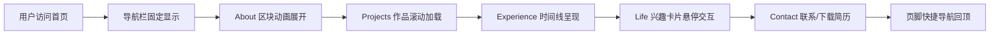

# 个人作品集网站 - 产品需求文档 (PRD)

## 1. 产品概述

为刘芳羽(广告学专业本科生)打造的个人作品集展示网站,以复古艺术风为视觉基调,融合3D膨胀字体、噪点纹理与撞色美学,集中展示视频/平面作品、实习与校园经历及个人兴趣爱好,用于求职与个人品牌展示。

- **目标用户**:招聘方、合作伙伴、潜在客户
- **核心价值**:用艺术化的视觉语言传达创作者的审美与个性,在求职场景中形成差异化记忆点

## 2. 核心功能

### 2.2 功能模块

1. **全站固定导航栏**:Logo/姓名 + 五个版块锚点入口,支持滚动高亮当前所在区块
2. **About 关于我**:头像、Slogan、自我介绍、技能可视化、求职意向
3. **Projects 作品集**:视频类作品区 + 平面/设计类作品区,每件作品附创作说明
4. **Experience 经历**:实习经历 + 校园/实践经历时间线
5. **Life 兴趣**:摄影、旅游、烘焙等兴趣展示
6. **Contact 联系方式**:手机号、邮箱、下载PDF简历按钮
7. **页脚**:版权信息 + 底部快捷导航

### 2.3 页面详情

| 页面区块 | 模块名称 | 功能描述 |
|---------|---------|---------|
| 导航栏 | Logo + 菜单 | 固定顶部,滚动联动高亮,鼠标悬停3D膨胀效果 |
| About | 头像形象 | 圆形/异形头像,悬浮旋转特效 |
| About | Slogan | 一句话个人标签,大字号3D膨胀字体展示 |
| About | 自我介绍 | 100字内简短介绍,杂志排版风格 |
| About | 技能可视化 | 工具+熟练度,条形图/环形图,滚动触发动画 |
| About | 求职意向 | 岗位+到岗时间+地点,卡片式展示 |
| Projects | 视频作品区 | 缩略图网格,悬停放大显示创作说明 |
| Projects | 平面/设计作品区 | 瀑布流/网格布局,点击查看大图 |
| Experience | 实习经历 | 时间线布局,左右交替卡片 |
| Experience | 校园/实践经历 | 时间线延续,卡片样式 |
| Life | 兴趣展示 | 网格卡片,图标+文字,悬停3D翻转 |
| Contact | 联系信息 | 手机号、邮箱可点击复制 |
| Contact | 简历下载 | PDF下载按钮,带下载动效 |
| 页脚 | 版权+导航 | © 2026 刘芳羽 + 快捷回顶按钮 |

## 3. 核心流程

用户访问网站 → 首屏视觉冲击(3D膨胀标题动画) → 滚动浏览About了解本人 → 进入Projects查看作品 → 滑动至Experience了解经历 → Life区块感受个人特质 → Contact联系或下载简历 → 页脚快捷回顶

## 4. 用户界面设计

### 4.1 设计风格

- **整体风格**:复古艺术风 + 孟菲斯设计语言,融合90年代杂志排版与现代3D效果
- **主色调**:
  - 背景:奶油米白 `#F5EFE0` / 深墨绿 `#1A3A35`
  - 主色:复古橘红 `#E85D3C`
  - 辅色:芥末黄 `#E8B53C`、宝石蓝 `#2B5F8A`、玫粉 `#D4577E`
  - 点缀:深棕 `#3D2817`
- **字体**:
  - 标题:Fraunces / Playfair Display(衬线复古)+ 3D膨胀描边效果
  - 正文:Cormorant Garamond / 思源宋体
  - 装饰:DM Serif Display
- **按钮风格**:3D凸起按钮,带阴影投影,悬停按压反馈
- **布局**:杂志感网格,非对称排版,元素重叠,大量留白与局部密集对比
- **图标/Emoji**:手绘风线性图标,搭配几何装饰元素(圆点、波浪线、星形)
- **特效**:
  - 鼠标跟随光标特效
  - 滚动视差
  - 噪点纹理叠加
  - 元素进场动画(staggered reveal)
  - 3D膨胀字体悬浮动画

### 4.2 页面设计概览

| 页面区块 | 模块名称 | UI元素 |
|---------|---------|--------|
| 导航栏 | 顶部固定栏 | 半透明背景,Logo左侧,菜单右侧,滚动高亮,悬停膨胀 |
| About | Hero区 | 大字号3D膨胀姓名+Slogan,头像圆形带描边,几何装饰 |
| About | 技能区 | 条形图横向展开,数字滚动,色彩撞色 |
| Projects | 视频作品 | 2列网格,悬停遮罩显示说明,边框粗描边 |
| Projects | 设计作品 | 不规则网格,卡片3D倾斜悬停 |
| Experience | 时间线 | 中线+圆点,卡片左右交替,滚动进度条 |
| Life | 兴趣卡片 | 3列网格,翻转卡片,图标手绘风 |
| Contact | 信息卡 | 大字号联系方式,3D下载按钮 |
| 页脚 | 底栏 | 版权+回顶锚点,装饰条纹 |

### 4.3 响应式

- 桌面优先(1280px+),平板(768-1280px)调整网格列数,移动端(<768px)单列堆叠,导航栏折叠为汉堡菜单

### 4.4 3D场景指引(不适用)

本项目以CSS 3D效果为主,不使用WebGL/Three.js全场景,保持轻量化本地预览。
