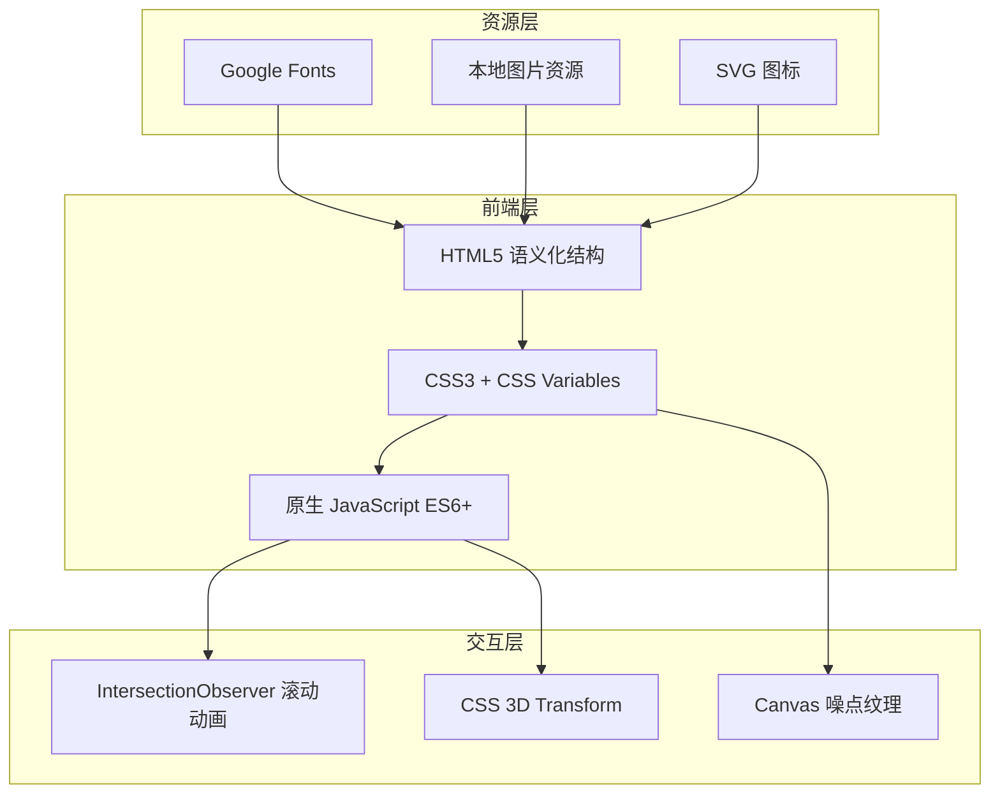

# 个人作品集网站 - 技术架构文档

## 1. 架构设计



## 2. 技术说明

- **前端**:纯原生 HTML5 + CSS3 + JavaScript(ES6+),无框架依赖,确保本地直接预览
- **构建工具**:无需构建,直接浏览器打开 `index.html` 即可预览
- **字体**:Google Fonts(Fraunces, Playfair Display, Cormorant Garamond, DM Serif Display, 思源宋体)
- **图标**:内联 SVG,自定义手绘风线性图标
- **图片资源**:使用 placeholder 占位,后续可替换为真实作品图
- **后端**:无
- **数据库**:无

## 3. 文件结构

```
网页/
├── index.html          # 主页面(单页应用)
├── css/
│   ├── style.css       # 主样式
│   ├── animations.css  # 动画特效
│   └── responsive.css  # 响应式样式
├── js/
│   ├── main.js         # 主逻辑(导航、滚动)
│   ├── animations.js   # 动画交互
│   └── cursor.js       # 自定义光标
└── assets/
    └── (图片占位说明)
```

## 4. 核心交互实现

### 4.1 滚动联动导航高亮
- 使用 `IntersectionObserver` 监听各版块进入视口
- 自动为对应导航项添加 `.active` 类

### 4.2 3D 膨胀字体效果
- CSS `text-shadow` 多层叠加模拟厚度
- `transform: perspective() rotateX/Y` 实现立体倾斜
- 鼠标移动时动态计算角度

### 4.3 元素进场动画
- `IntersectionObserver` 触发 `.reveal` 类
- CSS `animation-delay` 实现错落入场

### 4.4 自定义光标
- 跟随鼠标的圆形光标,悬停可交互元素时放大变形
- 使用 `requestAnimationFrame` 平滑插值

### 4.5 噪点纹理
- CSS `background-image` 配合 SVG `feTurbulence` 滤镜
- 或 Canvas 生成噪点叠加层

## 5. 路由定义

| 路由锚点 | 目的 |
|---------|------|
| `#home` | 顶部 About 区块 |
| `#projects` | 作品集区块 |
| `#experience` | 经历区块 |
| `#life` | 兴趣区块 |
| `#contact` | 联系方式区块 |

## 6. 数据模型(不适用)

静态内容,无数据库,所有内容硬编码于 HTML 中,便于后续直接编辑替换。
